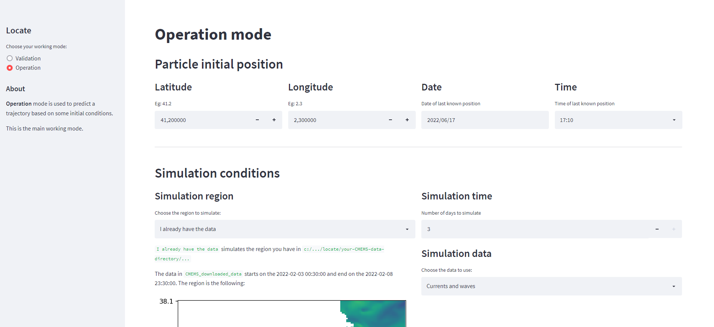
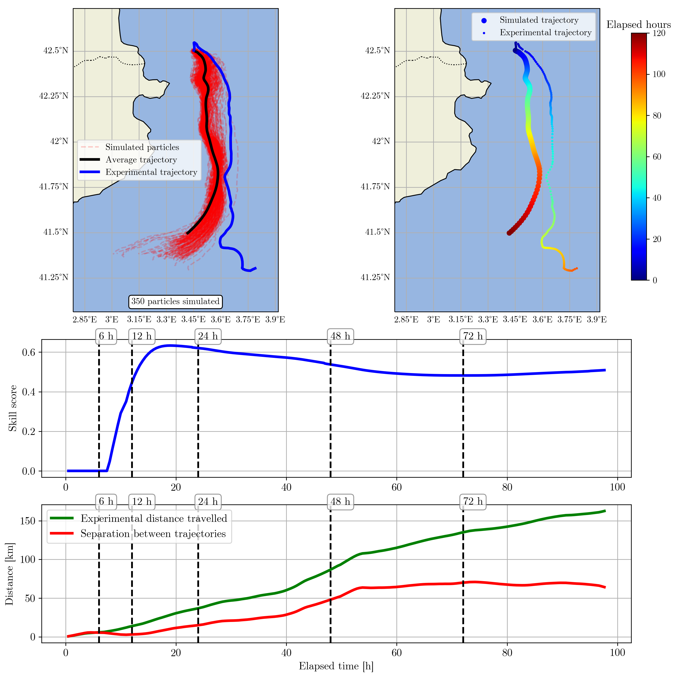

# LOCATE: Search and rescue

**Locate SAR** provides an interface to run lagrangian particle tracking simulations using [OceanParcels](https://oceanparcels.org/).



Results are displayed to help in the decision-making when accidents occur.



* Project: https://upcommons.upc.edu/handle/2117/371788?locale-attribute=en

## Structure of the root directory

* **`locate_sar.py`**: it is the main file 
* **/locate_modules**: contains the four main modules of the project
* **/utils**
  * **/locate_operations**
  * **/streamlit_operations**: layout of each working mode

## Clone the project and prepare environment

### Install Parcels
The first step is to clone the parcels repository. Run the following comands in your dedired directory:
``` 
git clone https://github.com/OceanParcels/parcels.git
cd parcels
```
Then, create a python environment using the `yml` file and run the `setup.py` file:
```
conda env create -f environment.yml
conda activate py3_parcels
python setup.py install
```
### Install Locate
Clone the locate repository in your desired directory and install all the required packages in the active environment:
``` 
git clone https://gitlab.com/josealsina/locate.git
pip install -r requirements.txt
```


## Execute

Run the following command in the root folder:
```
streamlit run locate_sar.py
```

- In order to download the data from CMEMS you need your own credentials. User and password should be in environment variables as `CMEMS_USER` and `CMEMS_PASSWD` (or in an .env file in root folder).

