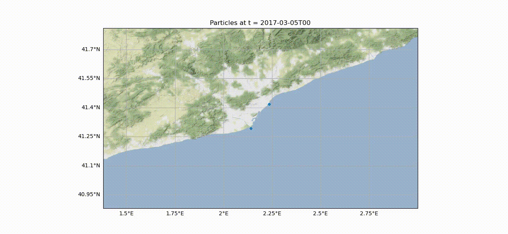

# LOCATE

Piece of numerical tools developed within LOCATE ESA-funded project to build simulations of plastic particles dispersion in nearshore water. Tools are based in [oceanparcels.org](https://oceanparcels.org/)



## SETUP
Setup for linux systems.

### Method 1: Setting up from scratch

#### Clone the project and prepare environment
First some system libraries that will be needed:
``` 
sudo apt install ffmpeg flake8 git build-essential gcc_linux-64 python3-mpi4py mpich libgdal-dev gdal-bin
```

To work with python it is recommended to make separate work environments for each project. 
``` 
git clone https://github.com/JoseAlsina2/LOCATE
cd LOCATE
python3.8 -m venv venv
source venv/bin/activate
pip install --upgrade pip
``` 
NOTE: if you use anaconda, you'll have to change the method of environment creation and activation. i.e:

``` 
git clone https://github.com/JoseAlsina2/LOCATE
cd LOCATE
conda create --name venv python=3.8
conda activate venv/bin/activate
pip install --upgrade pip
``` 

From this moment we already have the active environment. Any installation made with `pip` will be saved in this one and will not create conflicts with other projects.
Now it's time to install the libraries used in the project, some of which are prerequisites for plots.

Finally we can install the python libraries. It can be done one by one with `pip install <library_name>` or all at once with `pip install -r requirements.txt`.

Note that LOCATE is a set of tools based in oceanparcels.org. Therefore, installing Parcels is essential.

### Install Parcels

Continuing with the active environment, proceed to the installation of Parcels. We will first download it from the github repository where it is hosted and then proceed with the installation.
The download can be done in the desired folder, the important thing is that the installation is done with the active environment.

``` 
git clone https://github.com/OceanParcels/parcels.git
cd parcels
python setup.py install
```

### Method 2: Setting up LOCATE for Oceanparcels users

If you already are an Oceanparcels user and ahve installed Oceanparcels following instructions in https://oceanparcels.org/ or https://github.com/OceanParcels/parcels. We recommend installing Oceanparcels with dependencies using *.yml files as in  

## Execute

There are three main scripts in the project:
- data download: `DownloadLOCATE_Data.py`
- data preparation: `UPC_resample_datasets_ibi.py` 
- execution of simulations and visualization: `UPC_main_simulation.py`

There is a configuration file where variables and paths are pre-defined: `UPC_config.py`
In order to downlowd the data from CMEMS you need your own credentials. User and password should be in environment variables as **CMEMS_USER** and **CMEMS_PASSWD** (or in an .env file in root folder).

