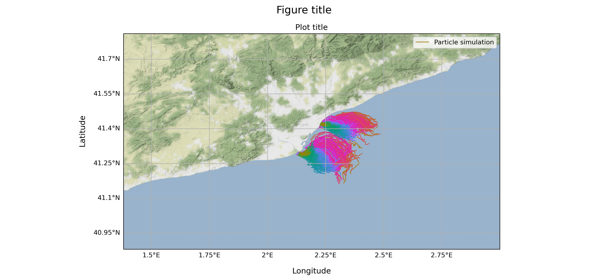

# LOCATE

Piece of numerical tools developed within LOCATE ESA-funded project to build simulations of plastic particle dispersion in nearshore water. Tools are based on oceanparcels.org.



## SETUP
Setup for Linux systems.

### Method 1: Setting up from scratch

#### Clone the project and prepare an environment
First, some system libraries that will be needed:
``` 
sudo apt install ffmpeg flake8 git build-essential gcc_linux-64 python3-mpi4py mpich libgdal-dev gdal-bin
```

To work with Python it is recommended to make separate work environments for each project. 
``` 
git clone https://github.com/UPC-LOCATE/LOCATE
cd LOCATE
python3.8 -m venv venv
source venv/bin/activate
pip install --upgrade pip
``` 
NOTE: if you use Anaconda, you'll have to change the method of environment creation and activation. i.e:

``` 
git clone https://github.com/UPC-LOCATE/LOCATE
cd LOCATE
conda create --name venv python=3.8
conda activate venv/bin/activate
pip install --upgrade pip
``` 

From this moment we already have the active environment. Any installation made with `pip` will be saved in this one and will not create conflicts with other projects. Now it's time to install the libraries used in the project, some of which are prerequisites for plots.

Finally, we can install the Python libraries. It can be done one by one with `pip install <library_name>` or all at once with `pip install -r requirements.txt`. There are some libraries, such as cartopy, which you may need to install manually regardless.

Note that LOCATE is a set of tools based on oceanparcels.org. Therefore, installing Parcels is essential.

### Install Parcels

Continuing with the active environment, proceed to the installation of Parcels. We will first download it from the GitHub repository where it is hosted and then proceed with the installation. The download can be done in the desired folder, the important thing is that the installation is done with the active environment.

``` 
git clone https://github.com/OceanParcels/parcels.git
cd parcels
python setup.py install
```

### Method 2: Setting up LOCATE for Parcels users

If you already are a Parcels user and have installed Parcels following the instructions in https://oceanparcels.org/ or https://github.com/OceanParcels/parcels, we recommend installing Parcels with dependencies using *.yml files.  

## Execute

There are three main scripts in the project:
- data download: `DownloadLOCATE_Data.py`
- data preparation: `UPC_resample_datasets.py` 
- execution of simulations and visualization: `UPC_main_simulation.py`

There is a configuration file where variables and paths are pre-defined: `UPC_config.py`

### Download the data

To download the data from CMEMS you need your own credentials. User and password should be in environment variables as **CMEMS_USER** and **CMEMS_PASSWD** (or in a .env file in the root folder). There is no need for user credentials to download data from the OPeNDAP server, although these are pre-configured to download data at coastal and harbour resolutions for the Barcelona area.

### Prepare the data

Once the files are downloaded, they need to be prepared using the `UPC_resample_datasets.py` script. There is a temporal difference between the CMEMS (30 minutes past the hour) and OPeNDAP (on the hour) data which requires interpolation, with the resulting files for each resolution having the same timedates.

### Conduct a simulation

The `UPC_main_simulation.py` script is used to run the simulation. By default, particles are released every hour, with the dates and amounts specified in the `Data_sampler/sample_simulation.xlsx`. In this case, there is one sheet per release point. There are provisions, however, for particle releases to occur at specified times and from different locations without an hourly or daily frequency, which may be useful when dealing with one-time only event, such as a drifter release. 

The script is executed using a series of kernels which are concatenated in line 167. By default, the kernels for advection, turbulent diffusion, Stokes drift, particle age, and particle beaching based on current velocity are provided. Other kernels, however, are provided in the `UPC_Parcels_kernels.py` script, such as particle beaching based on the particle distance to the shore (see the post-processing section). If incorporating other kernels, it is necessary to update the declared variables in the `PlasticParticle` class as from line 102. These are included but commented out to be used as required. If a variable is not declared here, the data will not be included in the resulting .zarr file for later analysis. A successful simulation will produce a visible progress bar in the iPython console (if using Spyder), and a resulting .zarr file. 

To run a new simulation, the `rewrite` variable in the config file must be set to True. A simulation can be re-run using the existing .zarr file data by setting the `rewrite` variable to False.

All the functions required for reading data from the Excel files to conduct the simulation or making plots are included in the `UPC_parcels_objects.py` script. 

### Plot the simulation

There are several options for plotting outcomes that can be specified in the config file, such as the path to save the plots and selecting the plots available. These include a particle trajectory plot (`plot_trajectories`), a particle density heatmap of the simulation end-time (`plot_concentration_heatmap`), and a video (`plot_animation`) showing the movement of particles during the simulation time. These can be run during the UPC_main_simulation.py script execution if they are set to True.

### Prepare distance to shore data

Scripts have been provided in the `scripts` folder to prepare the data step-by-step to use the beaching kernel based on the distance to shore parameter. For this, it is necessary to have (if possible) high-resolution shoreline data converted to a polygon in CSV format. In this case, the data were downloaded as a shapefile (not included) and processed using the open-source QGIS software to export as a CSV file (included).

`1_coastline_coords.py` reads and saves the coastline data.

`2_nodes_from_netcdf.py` extracts and saves the coordinates from the nodes of representative files for the regional, coastal, and harbour domains.

`3_nodes_differentiation.py` differentiates nodes based on whether they are on land or on water, according to the coastline data. 

`4_nodes_to_tupes.py` prepares the coordinates into tuples for later use.

`5_join_nodes.py` prepares the data from each domain by cutting into slices containing 1000 nodes each, due to computational limitations for calculating distances. Each node is then merged with the coastline data.

`6_calculate_distances.py` calculates the distance from each node to each point of the coastline.

`7_groupby_min.py` calculates the minimum distance from each node to the shoreline by grouping.

`8_concatenate_dfs.py` concatenates the grouped and streamlined distance data into a single data file per domain.

`9_join_distance_coords.py` joins the coordinate data with the distance data. 

`10_nodes_to_netcdf.py` prepares the data in netcdf format (one .nc per domain) to be used during the simulation.

To use the distance-to-shore data, the filenames must be specified in the config, the `distance_shore`, `distance_traj`, `prev_lon`, and `prev_lat` variables must be activated in the `PlasticParticle` class in the `UPC_main_simulation.py` script. Additionally, the `distance_shore` and `distance_trajectory` kernels must be included in the kernels declaration on line 167 of the `UPC_main_simulation.py` script, as well as replacing the `beaching_velocity` kernel with the `beaching_distance` kernel.


